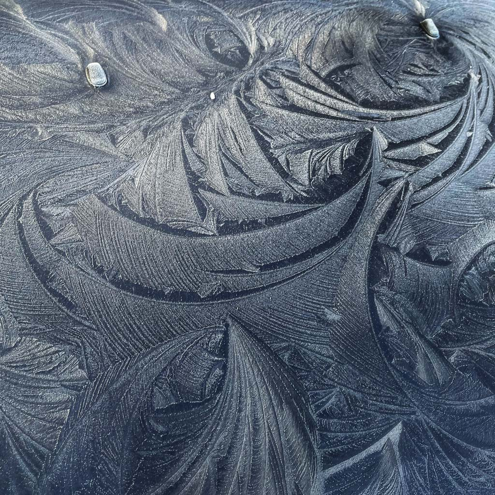

Nature was giving reminders this morning, in this photo I took on a car down the street.

This pattern looks carefully designed. It isn’t.

It’s mostly chaos, with just enough order to hold together as interesting.

> We need to design the conditions, not the outcome
> 

It’s the part most people get backwards.

In creative work and side products, we obsess over the wrong structure.

We plan the output, the polish, the long-term shape.

We try to eliminate uncertainty before we’ve earned any signal.

That’s designing the 80%.

The 20% that actually matters is smaller and less glamorous: a clear problem, a narrow audience, and a way to learn quickly whether it’s working.

Get those right and the rest can stay loose.

The rough edges aren’t a failure either, they’re where information shows up.

Too much order too early doesn’t make better work. It just makes brittle work.

So the goal isn’t perfect balance. It’s knowing exactly what deserves structure, and having the restraint to leave everything else alone.