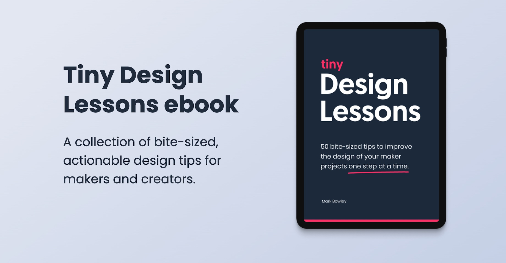

### One of my side projects is an ebook called Tiny Design Lessons, which recently passed a milestone of 150 sales.

Not huge in publishing terms, but this project represents something else. It’s been my first real success as an indie product creator. The 2019 version of me might not have believed those numbers.

So how did I get here and how did I achieve this?

The [book](http://tinydesignlessons.com/) is a collection of 50 simple tips on visual and usability design principles. It's aimed at online creators – everyday people from all walks of life, who have chosen to build things online in their spare time. Often without technical skills, and even more often without a design background like me. 

I wrote the book in 2020, looking for a personal challenge. No, not just because we were in COVID lockdown. I’d also reached a point in my life where I wanted to approach a side project in a more systematic way. I had built and launched [plenty of others](http://bowley.link/mb-launches) before that, but not with a process that increased the chances of success.

Instead of creating whatever I wanted to make, I decided to work out what I *should* make. To find out the overlap between my knowledge and actual needs, it meant following a process of validation. The goal was to avoid wasting my time creating the product or content, unless I had a high degree of certainty it would sell.

> First I wanted to understand the problem I was solving, before deciding on a format.
> 

I must confess, I didn't actually start out with the plan of creating an ebook. First I wanted to understand the problem I was solving, before deciding on a format. This is know as design thinking, a human-centred approach to solving problems used by product designers. I wanted to apply this method to one of my own.

I started with research, gathering insights from the indie creator community I was active in. I interviewed people with the problem I was trying to solve – trying to build things of value online, with no design skills. I looked for patterns and common wording in that research. That gave me enough insight to come up with potential ideas. I settled ebook format at this point, as it seemed more accessible and handy than a course.

> First I created a book 'prototype', which consisted of 3 example pages.
> 

I didn't start writing after that. No, I hadn't validated the idea. I only had the problem defined. So first I created a book 'prototype', which consisted of 3 example pages. With that, I set up Zoom calls with the original interviewees and observed them going through the pages. Like a mini user testing session. This gave me insights about their feelings on the content, the value it gave, and the usability of the format.

Most importantly, I asked for pre-orders from those that gave positive feedback. That gave me enough validation (25 pre-orders) to commit to creating the full product. I could confidently get on with writing. 

The book launch did very well, and to date I’ve sold over 150 copies (yes, it’s still selling). I believe much of this was down to doing proper research at the beginning, rather than taking a chance. Ebooks can be hard to launch or sell, and often fail. It all made the process longer, but in the long run it’s been worth it.

Along with sales, it's also given me plenty of exposure as a creator. It's established me as something of a design expert amongst the target audience. It seems silly to say that, with a 25 year career. Yet, when you're selling your own products you have to prove it all over again.

> It piqued Airtable’s interest, and they interviewed me for their blog.
> 

One highlight was being [featured by Airtable](https://blog.airtable.com/bookdesign/), a tool I used in the content creation. I had taken the unusual step of creating my book content in Airtable, and using their tools to export it as an ebook. That piqued their interest, and they interviewed me for their blog.

I’ve also continued to create educational design content. I’m a Practioner in Residence at the [100DaysOfNocode Bootcamp](https://www.100daysofnocode.com/no-code-mvp/?source=mark&campaign=champions), where I've created design guides. There’s also other products on my [Gumroad shop.](https://markbowley.gumroad.com/)

The book [continues to sell](https://markbowley.gumroad.com/l/tinydesignlessons), even though I'm not actively marketing. That's fine with me, as the content is intended to be timeless. I'm just grateful to everyone who's believed in me enough to buy the book.

What's next? I'm planning on publishing some even tinier design tips through the Tiny Design Lessons newsletter. More on that in another blog post, but if you’re intrigued why not [subscribe](http://tinydesignlessons.com/) now.