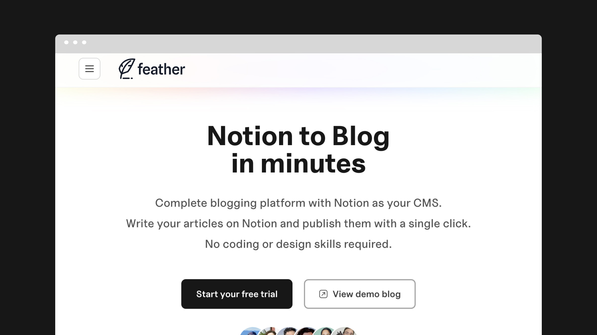

I’ve worked in WordPress for over 12 years now. It’s become second nature to me. But at the same time I dislike the tool these days. 

The user experience, once market-leading, is now quite tiring to use. It’s not moved on quick enough compared to other modern software tools in my opinion. It’s stuck trying to be everything to everyone, instead of good at something. 

Then there’s also the self-hosting management, which is another hassle. Once the only way to host a website, it now seems much like the tool itself. Uneccessary hard work.

I probably sound a bit tired of it don’t I? Don’t get me wrong, WordPress is still a useful tool, it’s just that there are better options for some use cases now.

I guess my feelings about it showed quite clearly in my lack of posting when I started this blog on WordPress, in 2020. Then, I can’t blame it all on WordPress. I’ve found it generally hard to get insipred or find the mental energy to share my thoughts. 

> I’ve found it generally hard to get insipred or find the mental energy to share my thoughts.
> 

This summer I decided to change that. I set a goal of writing more, especially online. 

Why? Partly to practice writing, to develop a habit of it. It’s very easy as a designer to just stick to visuals all the time, but that doesn’t give people much of an insight into your thoughts, process or your thinking. 

Those are increasingly more important in a noisy, competitive market, when you want to apply for jobs or stand out as a freelancer.

To achieve this goal I needed to feel inspired to write and publish, not find it difficult or a grind as a process.

> I needed to feel inspired to write and publish, not find it difficult or a grind as a process.
> 

So in an effort to shake off the WordPress blues, I recently decided to try a new tool. Something that would make it fun. I’d been following a developer on Twitter for a while, who was building a [Notion-to-blog tool](https://feather.so/?via=mark). 

I was intrigued. 

I love using Notion for organising information, and the idea of using it to blog has appealed to me for a while. There just hasn’t been an easy way, until now. 

This new tool is called [Feather](https://feather.so/?via=mark), and for a new, boostrapped product it’s already very polished and feature-rich. The on-boarding and setup experience was also smooth and trouble free. Almost easy. I had my blog set up and parked on my own domain within an hour. 

One of the best things about Feather, compared to WordPress, is that you don’t need to use it to write and publish. You can do all that in [Notion](https://notion.so), a tool I’m already familiar with and use everyday. 

This in itself makes the process so much easier. Not having to shift your mindset into the WordPress UI and workflows to publish means you’re already more likely to.

> Then there’s the web hosting. You don’t need any, it’s a hosted platform.
> 

Have I mentioned custom domains? This is where it gets interesting in my opinion. Not only can you easily publish a Feather blog to you’re own custom domain, you can also add it to a subdomain (e.g blog.mysite.com) or subdirectory (e.g www.mysite.com/blog) of an existing website. 

This can be incredibly useful for businesses or startups who already have a website or landing page, and haven’t added a blog for some reason. For example, maybe the platform their website is on doesn’t have that feature, or it’s an expensive upgrade. Or maybe they don’t want too many people with editing access to the site.

I’ve added it to one of my side projects, [starrt.co](https://starrt.co). This site is built on carrd.co, which doesn’t have a blog feature at all. So Feather gave me a relatively easy way to add a blog.

There’s one other use case for Feather, that doesn’t get mentioned in it’s marketing. Not only can you build a blog with Feather, really you can make a whole website – all from Notion pages. Perfect if you’re thinking about setting up a personal website + blog, and wondering what tool to use.

Currently you cannot change the design stylings (that’s on the roadmap). Even so, the out-the-box design is very clean and smart for a new product. You can also adjust the layout and and a few other settings to customise your setup.

So, the question is have I inspired myself to write? It seems to be working so far. Watch this space, or better still, subscribe below to know every time I publish!

Update 2023: Feather now has some basic design styling options.