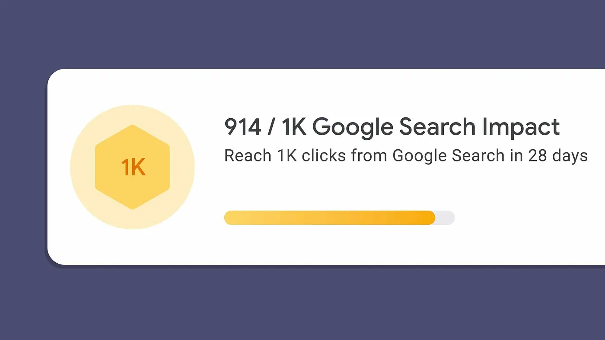

### Closing in on this milestone as a beginner in SEO, this is what I’ve learned.

First, a bit of backstory. I’ve built and grown a site called [Starrt](https://starrt.co/), since 2021. It’s a niche directory and blog, for users of the web platform [Carrd](https://try.carrd.co/bowley).

This was the first site where I payed attention to SEO, having never really understood it before. I decided to give it a go, and have made consistent small efforts with it since launching the blog on the site in 2022.

So to be closing in on **1000 monthly Google clicks** now, I’m really pleased that work has born fruit.

But it’s not as simple as ‘do the work, then reap rewards’. So a bit more context is needed for you to understand why I’ve achieved this.

Here’s a little roundup of the things I believe have contributed.

## **Find an underserved keyword**

Most importantly, I started by observing that Carrd did not have any resources of its own. That was the reason for starting the site in 2021, but then as I learned about keywords I noticed there were growing search volumes for Carrd related topics. This represented an opportunity which I honed in on.

## **Pay attention to long tail**

Not only was there an opportunity around keywords like ‘Carrd xxx’, I observed there were lots of long tail keywords too. Some I only discovered through writing experimental blog posts, some of which, to my surprise, ranked really well. All this has been critical to ranking and gaining organic clicks.

## **Write for search intent**

There’s no point just writing for keywords without understating search intent. It will simply result in impressions not clicks, or clicks followed by low engagement.

In this case, I could tell that the searches were questions looking for answers, so write all my content to give that, in the form of short tutorials.

## **Structure and tag your site content properly**

Not only is your content important but your site needs to be structured for Google. This means things like including your keywords — in your page titles, first 100 words of content and in sub headings too, if possible (written as naturally as possible).

Headings also need to be structured and tagged appropriately, like H1, H2, H3 and so on. (Note: I’ve written a short [guide on SEO in Carrd](https://markbowley.gumroad.com/l/carrd-seo), which has some general advice on this if you need it).

## **Target backlinks**

Google is placing more emphasis on quality sites linking back to yours, so a new site will not get ranked without at least a few of these. Unfortunately they’re not easy to get, without some work. There are, however, some fairly [easy or free places to start](https://drbacklinks.xyz/).

## **Monitor results**

Lastly, a simple piece of advice — keep an eye on stats and data, both in website analytics and in Search Console. I’ve found these invaluable in knowing where to make adjustments, or apply more effort.

Keeping an SEO diary is another good way of keeping track of what works — if you combine it with the stats and data.

<aside>
📎

Note: originally published on my [Tiny SEO Lessons](https://medium.com/tiny-seo-lessons) blog

</aside>