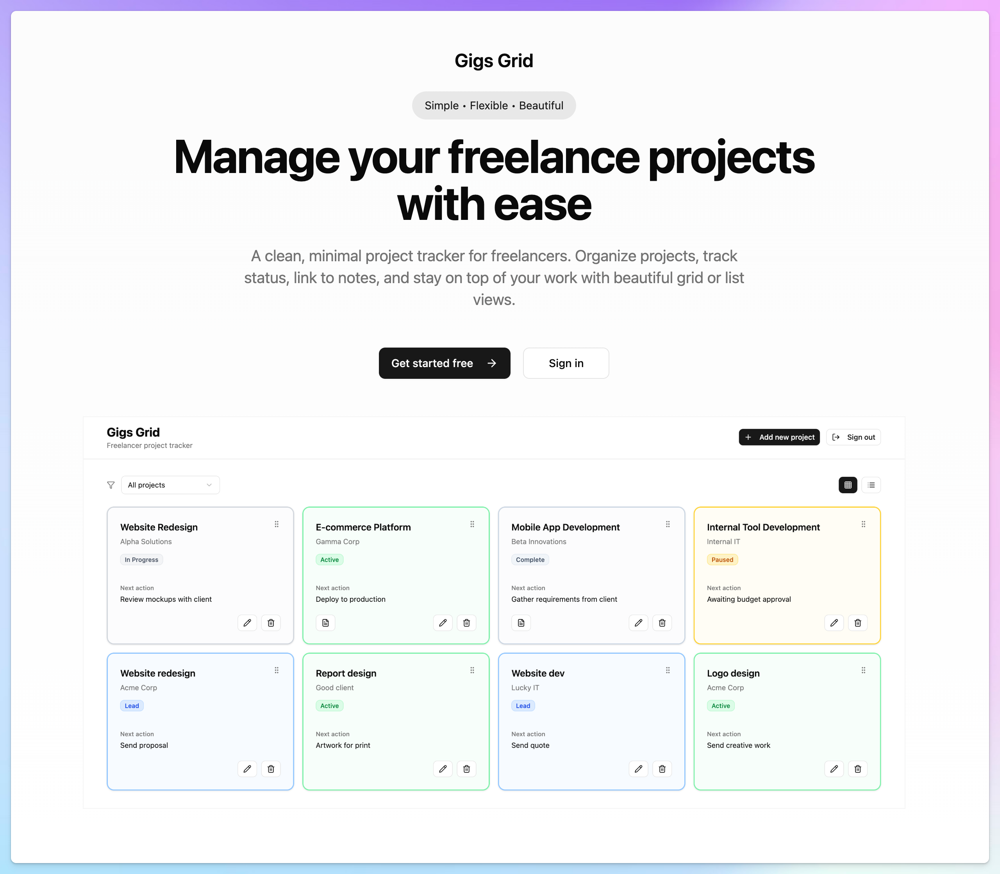

AI builders like Lovable and Bolt are great, until they aren’t.

You describe what you want, wait for the magic to happen… and then realise you can’t *actually* change much. Well, you can but it takes time and tokens. They make it easy to get started, but hard to take control. You’re stuck inside their interface, at the mercy of prompts and burning tokens to fix things that could take seconds to tweak, for someone who knows how.

That’s been my biggest frustration with AI builders so far (I’ve preferred hand coding with AI in support). They promise flexibility, but fence you in.

> They promise flexibility, but fence you in
> 

Then I recently tried [**Raydian**](https://raydian.dev/). Finally, an AI builder that doesn’t get in your way. I had been following their pre-launch with interest, and now I’ve tried it. It definitely seems to deliver. 

It’s part AI builder, part no-code app, part coding environment, and the switch between them is fairly seamless. I spun up an [app](https://willowy-gray-goose-dev.apps.devize.com/) with one prompt, then jumped in to tinker with the styling and layout myself, both in no-code and code. No waiting, no guessing, no token burning.

The app I built in Raydian

It’s the first AI tool I’ve used that actually *lets* you build how you want, not just describe what you’d like to build or change. 

> It’s part AI builder, part no-code app, part coding environment
> 

I can see something of other tools in it, such as Bubble and Webflow. If this is where some AI creation tools are heading, it’s a good sign. 

For those who can and want to tinker and adjust by hand, it will mean less prompting, more making.