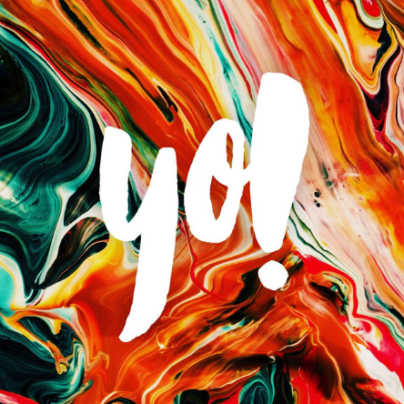

I’m not a big podcast listener. 

I listen to a limited few, but find many others have way too much chatter for my limited attention and time. They often strike me as serving the podcaster more than the audience.

However, once in a while I find one or two that are more signal than noise. I recently dipped back into [Yo! by Rob Hope](https://open.spotify.com/show/7cnrLotBo3valxteAfZO3H?si=993ca0d7eff04115) and remembered how good it is. 

On Yo!, Rob interviews designers, makers and entrepreneurs building their own future. It’s not new or particularly frequent, but that doesn’t matter. It’s polished, with a snappy pace, and has just enough chatter mixed with big value. I highly recommend it.

That got me thinking. I’ve often pondered the idea of making a podcast myself – yes they’re obviously trendy, but also incredibly useful for exposure and personal brand building. Could be a really good idea…

But, wait. I’m not a strong talker, so the idea of having to make these regularly always really puts me off. I just put the thought aside all over again.

However, looking at pods like Yo! recently, I’ve realised you don’t need to. By interviewing only the top talent in your subject area, you can just record them as and when you can book the right people. 

No need for weekly, or even monthly. 

In fact, no pressure at all. 

I may come back to this idea.