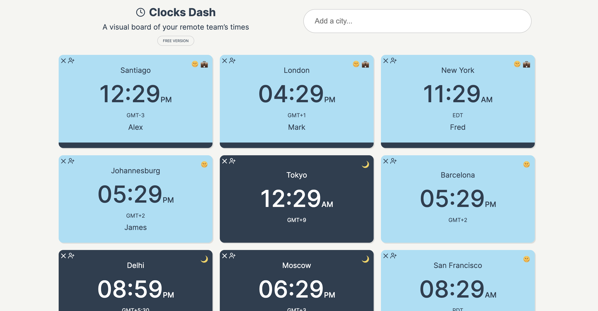

If you’re in a remote team, you know that scheduling across multiple time zones can be a headache.

You check your calendar, message a teammate, then double-check if it’s too early or too late for others. Maybe you ask Alexa ten times a day, “what time is it in X?”.

Even if you’re not on a team, often with a spread out international family it can be a challenge to keep track of what time it is for everyone. 

Instead, here’s a quick way to make it more painless.

Try [clocksdash.com](http://clocksdash.com/) – a lightweight dashboard prototype I made for remote teams.

Add your cities, add team mate names to clocks, share with your team, and avoid the 3 AM pings forever.

It’s just a prototype at the moment, but this is what you can do with it:

1. **Visualise all team times at a glance**
In the dashboard you can add each teammate’s city. You instantly see what time it is for everyone.
2. **Spot the overlap quickly**
Look for overlapping work hours, no mental math required. Day/night shading and emojis make it obvious when someone’s asleep. Office hours clocks pin to the top of the grid, for easy reference. 
3. **Share a single link**
Instead of sending multiple emails, share the dashboard link. Everyone sees the same view in their browser (teams can’t edit yet, only view a shared dash).
4. **Use it as your browser start page**
Keep it handy by going to settings and adding the URL as the standard home page for new tabs.

> Office hours clocks pin to the top of the grid, for easy reference.
> 

Keep it open every day, and scheduling becomes effortless.

Sure there are other tools that do something similar, but as a designer I wanted something that was very visual, and nice to use – not just a dull utility.