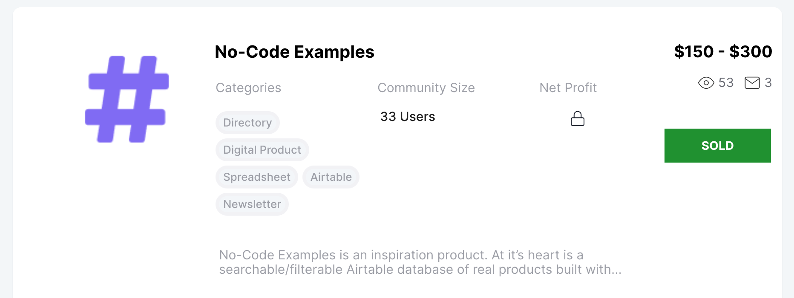

It sounds like I’m on a roll from the headline, but I’m not. Selling two side products in ten years isn’t a very productive rate. Yet I still see it as an achievement.

[I’ve been creating side projects since 2009](https://bowley.link/mb-launches). Back then I started with one every few years, and wasn’t focussed on selling them. I was focussed on creating, and enjoying it too.

My first side project was a blog on freelancing, which I built on WordPress (the best way at the time) in 2009. I eventually sold that around 2013. 

It wasn’t for lots of money, but it was a start. It was more about the principle that I could create something from nothing, and sell it. And this was before that kind of thing became common. 

> It was more about the principle that I could create something from nothing, and sell it.
> 

What happened next isn’t really what I intended. I created other side projects, but work and life got too busy to finish or market them properly. They came and went without much impact. [Some are still live today](https://bowley.link/mb-launches).

That was until I discovered the no-code movement in 2019. Realising there were many more tools to build with, and a strong community of support, my productivity increased. 

So what about this project I recently sold? In 2020 I created a website called No Code Examples. It was just a little list of products people had made with no code tools, mainly for my own inspiration and reference. Everyone talked about the benefits of no-code, but there was no list of success stories. I used Airtable as a database, and embedded it on a [Carrd](https://try.carrd.co/bowley) landing page. 

As with many other experiments, it got left for a while. Eventually, in late 2021 I decided to dust it off and try to make something of it. I gave it a design upgrade, added lots more content and tried to market it.

> As with many other experiments, it got left for a while.
> 

It did reasonably well, but I realised I couldn't give it the love it needed. It wasn't bringing me enough benefit compared to the work I was putting in. So in spring this year, I listed it on [tinyacquisitions.com](https://tinyacquisitions.com/profile/mark) to gauge interest.

I had a few offers, but at the same time I had an idea. I realised it would be a great marketing tool for my friend Max who founded [100daysofnocode.com](https://bowley.link/100daysNC). It seemed much more suited to his goals and motivations, and could be a valuable reference for his community of beginner no-code makers. 

He loved the idea and we agreed a private sale. So in July we completed the transfer, and Max did an amazing job of [relaunching](https://nocodeexamples.com/) a few weeks ago.

I feel happy I’ve made a sale, even if it’s only in the three-figure range. What’s more satisfying though is going through the process, learning from it, and seeing the project end up in good hands. 

> I feel happy I’ve made a sale, even if it’s only in the three-figure range.
> 

Selling another project after a ten year hiatus has also inspired me to see the possibilities once again. If you're good a starting projects, but don't like the idea of long term commitment, you don't have to stick with them forever. You can build to sell.