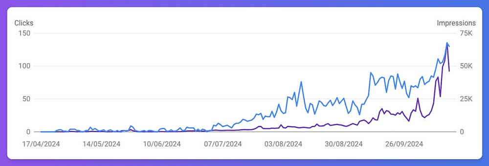

Canonical URL: https://medium.com/tiny-seo-lessons/keyword-success-taught-me-a-valuable-seo-lesson-915ed2c8d625

Just getting lots of traffic isn’t the only thing to be thinking about.

Earlier this year, I started an experiment with an [SEO-driven directory site](https://freeappsai.com/) for a side hustle.

The idea was simple: target a specific, in-demand keyword and see what kind of traffic I could generate.

I’ve now realised a mistake in my thinking. You live and learn.

At the time, I wasn’t too concerned about the commercial side — it was more of a learning experience and experiment.

Fast forward to now, and the directory is doing very well in terms of traffic (7K/mo). It’s getting lots of organic Google clicks too (2.5K/mo), bringing in thousands of monthly visitors.

But there’s the catch: it’s not making any revenue yet.

It may do one day (I have some ideas up my sleeve) and even if it doesn’t I don’t mind. As they say with side hustles, you often have to make lots of mistakes before you start to find success.

So what was my mistake? The keyword I built the [site](https://freeappsai.com/) around includes the word “free,” which doesn’t exactly attract people looking to spend money — neither users or sponsors.

### While the traffic numbers are great, the commercial potential is limited.

So I’ve learned a valuable lesson — if you want to generate revenue one day, targeting keywords with commercial intent is just as important as driving traffic. If you’re only experimenting and learning, it’s not such a big deal.

I don’t regret the experiment. It’s taught me a lot about balancing SEO goals with business goals, and that’s something I’ll take into my future projects.

<aside>
📎

Note: originally published on my [Tiny SEO Lessons](https://medium.com/tiny-seo-lessons) blog

</aside>