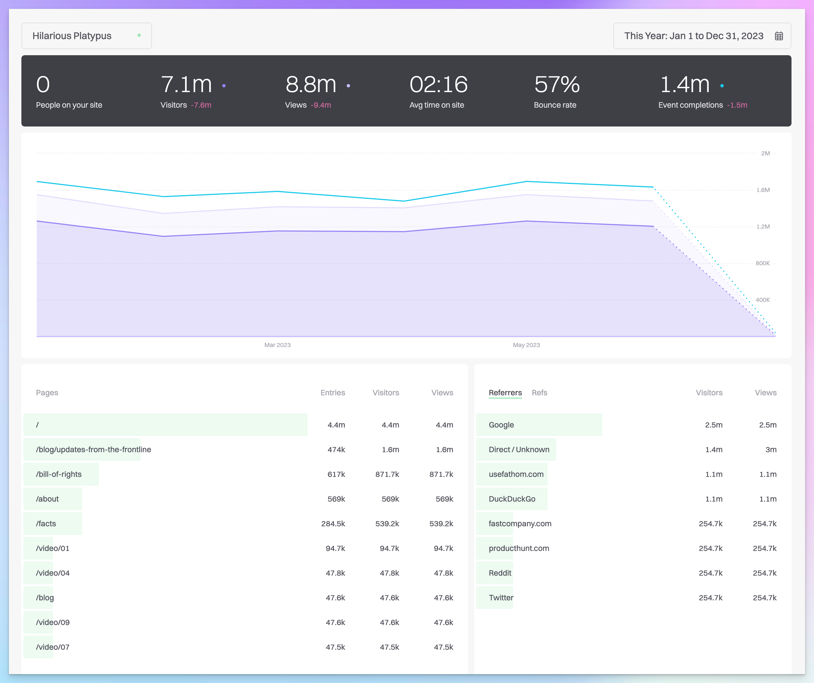

The story starts in 2021. Well before that actually. But since 2021 I’ve been using [Fathom Analytics](https://usefathom.com/ref/YUFDSM) to get simple data and insights from all my websites. I struggled for years before that with Google Analytics (GA), and just couldn’t get on with the overcomplicated, unintuitive interface. 

I stopped caring about the insights because of the software. So when decent alternatives came along, I switched. I didn’t need a push. 

Since then, I’ve loved finding insights all over again. And in most cases, I also don’t have to display those annoying cookie notices. Don’t you hate them? GA is largely responsible for their need, but there are no cookies with Fathom. I’ll say that again – no cookies!

These two reasons alone are enough to show how much more pleasant and ethical Fathom is. But let’s dive a bit deeper, and go into some wider benefits of switching away from Google. 

### The interface & UX

Google closed it’s Universal Analytics today (1 July 2023), causing big headaches across the globe. It’s successor, GA4, is even harder to use. Getting the information you need or finding anything is nearly impossible unles you’re an expert. 

> Even putting analytics aside, it’s one of my favourite apps to use.
> 

By contrast, I find [Fathom](https://usefathom.com/ref/YUFDSM) is a pleasure to use. Oh my word. It's so much simpler and easier to understand than GA. Even putting analytics aside, it’s one of my favourite apps to use. I just don’t have to think so much when I use it, which should be the goal with any app. The most important data I need is front-and-centre, not buried in complex, clunky options.

The main dashboard. It’s so clear, you almost wouldn’t recognise it as analytics…

### Ethics & privacy

This is a big problem with Google. It tracks, stores and monetises personal information about your website visitors. Ugh. Why does it do this? Because their business model is simple: offer free tools to mine information, which feeds the core business – advertising. GA was even ruled illigal in the EU, due to its lack of compliance with basic privacy (also one reason they’ve shut down Universal Analytics and are forcing everyone onto GA4 – which is compliant, but a beast to use).

[Fathom](https://usefathom.com/ref/YUFDSM) on the other hand, is a polar opposite. Its business model is privacy by design**.** It doesn’t store or use **any** personal data (why isn’t this the standard?).

They’re a small, independent team, and intentionally so – they’ve turned down venture capital in order to stay unbeholden to stakeholders. Does that make them a risky bet? No, they’ve been profitable from the start (3+ years) and continue to grow (1000s of of customers). 

To add a little icing on that cake, they even donate to planet causes – giving 1% to the Rainforest Trust and 1% to Stripe’s carbon removal program. 

> Fathom on the other hand, is a polar opposite. Its business model is privacy by design**.**
> 

### Used by notable companies

I know, I’m gushing enthusiasm. It almost seems like a fake review. It’s not intentional, I’m just a UX designer that likes to highlight what I think is well-produced, useful software. 

You don’t need to take my word for it though, as [Fathom](https://usefathom.com/ref/YUFDSM) boasts some well-known tech customers. Companies who’ve chosen to be very unlike ‘big tech’ and protect your privacy, such as IBM, GitHub, Buffer and Fastmail.

### Am I biased?

Let’s be honest, I’m being very enthusiastic here. If you doubt my motives, let’s do some full disclosure. Yes, I do get referral fees if you sign up for [Fathom](https://usefathom.com/ref/YUFDSM). But no, I don’t recommend it for that reason. Those (small) fees just help me pay for all the software subscriptions I need to run my own business. 

In truth, I’d recomment Fathom anyway, as I hate to see businesses not being able to take advantage of something useful because of bad tools.

### Just try it

Anyway, if you think I’m being over-the-top you could just give it a try and find out for yourself. You can try [Fathom](https://usefathom.com/ref/YUFDSM) with a 30 day free trial, and take one small step in enjoying analytics again. If you like it, you can use [Fathom’s](https://usefathom.com/ref/YUFDSM) free Data Importer (also amazing btw) to bring your GA data with you, and you’ll also get $10 off with my link.

It costs $168/year ($14 monthly) for which you can track up to 50 sites. You only pay more if you need very high-traffic bandwidth. 

[Just try it,](https://usefathom.com/ref/YUFDSM) I’m happy to be proved wrong if you think I’m over-selling here.

In another post soon, I’ll write about the insights I’ve been getting from Fathom.