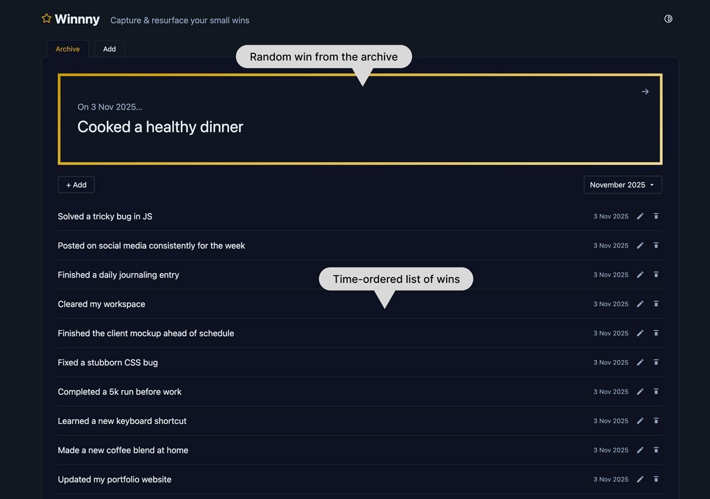

I don’t know about you but this year I discovered I keep forgetting the good stuff. The small wins that actually help motivation and positivity. The projects that landed well. The moments where things worked out. The good feedback.

They all get buried under the endless next-thing-to-do list. Always looking forward.

And this time of year makes it all the more harder. It’s Year Wrapped season. Lots of apps sending you your year in review, but only what you did on their platform. They don’t collect those small wins.

So I built [winnny.com](http://winnny.com/) as a prototype a few weeks ago. Too late for this year’s Wrapped season, but perfect for setting us all up for next year (or sooner).

It’s just one simple web page. Currently there are no logins, no dashboards. You add a win, and it logs it in a time-based archive.

Every time you open it, one of your wins gets featured large, front and center. A random reminder of progress. It’s a small nudge that helps you feel a bit better about your day, and your progress.

> It’s a small nudge that helps you feel a bit better about your day, and your progress.
> 

Mostly it just sits there quietly, ready to log wins and ready to remind you that you’ve done more than you think.

As it stores data in your browser at the moment (no app database), you can export/back up your wins at times if you want.

A friend I showed the prototype to said “I absolutely love this”.

Most productivity tools push you to plan more, do more, achieve more. [Winnny’s](http://winnny.com/) the opposite. It’s about looking back and smiling.

> It’s about looking back and smiling.
> 

I’m not sure where it’ll go next. I have ideas to expand it if people are interested, like export to social image, or quarterly review emails. But for now, it’s enough. It’s useful to me, and hopefully to others as a starting point.