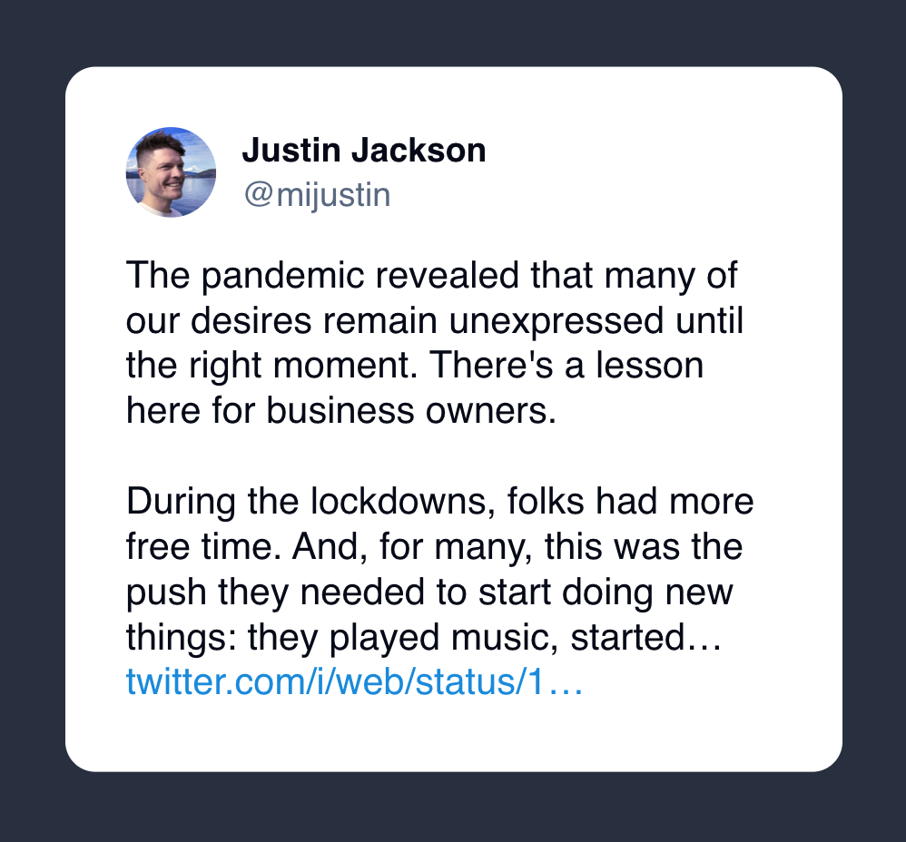

I thought [this post on X](https://twitter.com/mijustin/status/1724864499067585011) a few weeks ago was a massively good point by [@mijustin](https://x.com/mijustin), an overlooked way of think about business or product ideas.

***“Many customers are on the cusp of taking action; they just need a slight nudge to take the leap.”***

In short, lowering the barriers to personal, desired action is a good product strategy.

Rather than trying to create a new need or demand, it may be more effective to target those customers who are already actively working towards a solution to a problem or challenge. 

By offering them a product or a service that provides a simple and low friction method to leap forward in their efforts, you can effectively meet their needs or desires. 

This approach is not only customer-centric but also business-smart as it focuses on providing real value to the customers while also driving business growth.