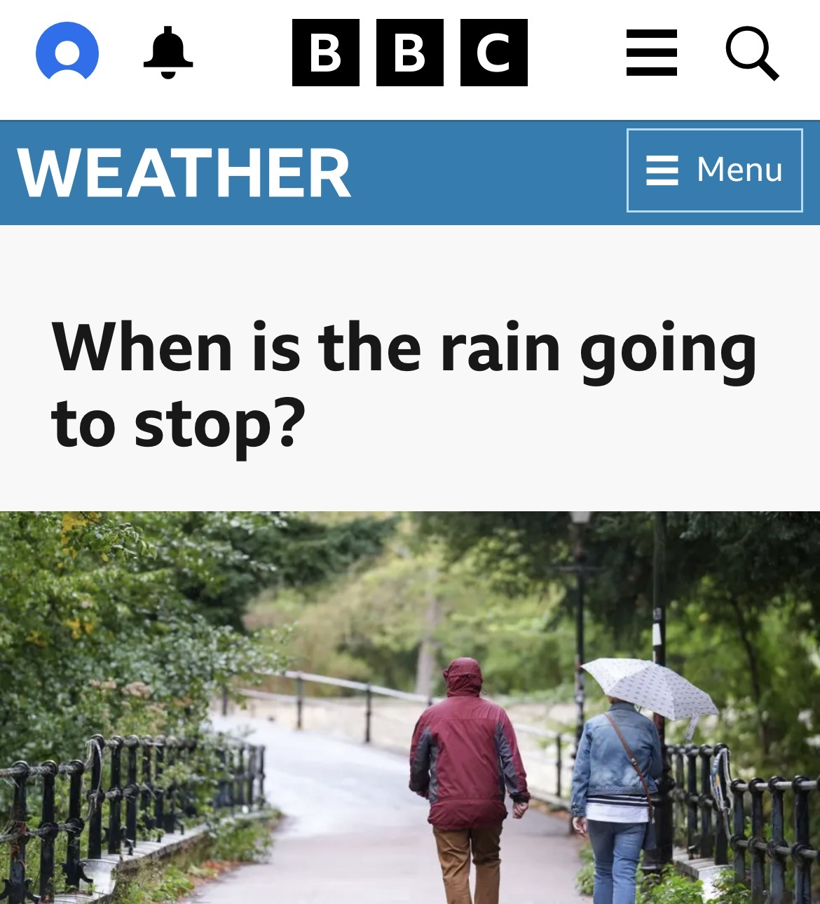

Britain has a complicated relationship with the weather.

Too hot and we’re complaining. Too cold and we’re complaining. Too wet and we’re *definitely* complaining.

It’s practically a national pastime. We can spend ten minutes discussing the weather with a complete stranger and somehow feel we’ve had a meaningful social interaction.

So perhaps we shouldn’t be surprised by a headline like this. 

Except that, just three weeks earlier, the headlines were asking when the heat was going to stop.

And therein lies something more interesting than the weather.

**We have an extraordinary appetite for consistency in a world that isn’t particularly consistent.**

Three weeks ago, it was hot.

The heat felt relentless. The headlines reflected it. We talked about heatwaves, drought, records and how long it would last.

Now it’s raining.

And suddenly we’re asking when *this* will end.

There’s nothing particularly irrational about this. Humans experience the world in the present. We don’t walk around with a perfectly calibrated statistical model of the climate in our heads. We experience *today*, compare it with what we expected, and construct a story around the difference.

The problem is that we increasingly expect the world to behave more like a product.

And that’s where technology comes in.

It’s trained us to expect predictability.

Good design is, in many ways, the art of removing uncertainty.

A good interface tells us where we are.

It tells us what we can do.

It gives us feedback when we’ve done something.

It behaves consistently enough that we can build a mental model of it.

After using a well-designed product for long enough, we stop thinking about the interface at all. We simply expect it to work.

That expectation has spread far beyond software.

We expect information to be immediate.

We expect deliveries to arrive when promised.

We expect maps to know where we are.

We expect algorithms to understand what we like.

We expect AI to understand what we mean.

We expect services to remember us.

We expect technology to anticipate our needs.

We’ve spent decades designing friction and uncertainty out of everyday experiences.

And it’s worked.

Perhaps too well.

**The world isn’t an interface.**

The weather doesn’t care about our expectations.

Neither do markets, politics, people, ecosystems or, increasingly, the technologies we’re building.

These things are complex systems. They contain probabilities, feedback loops, randomness and unintended consequences.

Yet we’re increasingly surrounded by interfaces that disguise that complexity.

A weather app gives us a neat row of icons.

A news site gives us a headline.

An AI gives us an answer.

A dashboard gives us a number.

The messy underlying system gets converted into something that *feels* certain.

And when reality subsequently behaves differently, we experience that not simply as uncertainty, but as **something having gone wrong**.

This is where design gets interesting.

For a long time, one of the central ambitions of design has been to make things easier to understand.

That’s still valuable.

But perhaps there’s a difference between **reducing unnecessary uncertainty** and **pretending uncertainty doesn’t exist**.

The first is good design.

The second can become bad communication.

A weather forecast isn’t a promise. An AI response isn’t necessarily truth. A recommendation isn’t certainty. A five-year business plan isn’t a prediction of the future.

They’re attempts to navigate uncertainty.

Yet we tend to package them as definitive things because definitive things are easier to communicate, easier to sell and easier to understand.

**Certainty is a very attractive interface.**

And groups make it worse. We don’t form these expectations alone. We form them collectively.

If everyone around us is talking about a heatwave, the heatwave becomes more than weather. It becomes *the thing that’s happening*.

If everyone is complaining about the rain, the rain becomes evidence that summer has failed.

The same thing happens with technology.

A new product is described as revolutionary, so we expect a revolution.

AI is described as transformational, so every awkward interaction feels like a failure to live up to the promise.

An app is marketed as effortless, so even a small amount of friction feels disproportionately irritating.

Our expectations are shaped socially before we ever experience the thing ourselves.

### Perhaps that’s the real paradox

The more predictable we make our **experiences**, the less tolerant we become of an **unpredictable world**.

We’ve built incredibly sophisticated systems for managing uncertainty, and they’ve given us the impression that uncertainty itself is something that should be eliminated.

But it can’t be.

The weather will change.

People will behave unpredictably.

Technology will fail.

Markets will move.

Plans will go wrong.

AI will surprise us.

And we’ll continue to complain about the rain.

That’s not necessarily a problem.

Maybe the more interesting challenge for designers and communicators is to stop treating uncertainty as a failure of the experience.

**Perhaps good design isn’t about making an unpredictable world feel certain.**

Perhaps it’s about helping people understand what is certain, what isn’t, and what they can do about it.

Because the world isn’t becoming an interface.

**We’re just increasingly expecting it to behave like one.**